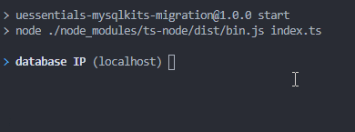

# uessentials-mysqlkits-migration
 Migrate kits from uEssentials to MySQLKits

## Usage

- Install NodeJS
- Clone this repo
- Copy-paste your kits.json in it
- Open a terminal inside the project folder
- Run the following commands

```
npm install
npm run start
```

